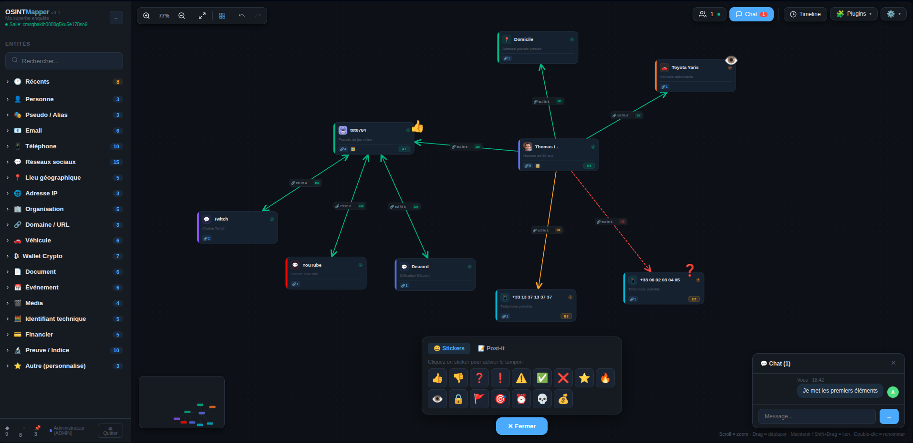
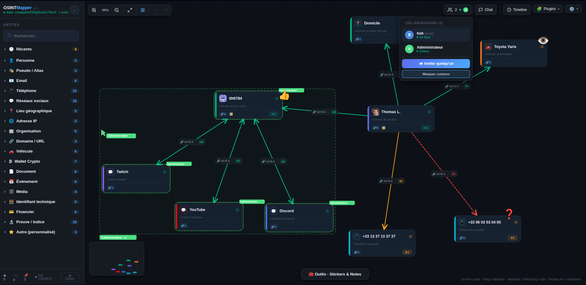

# OSINTMapper

**Plateforme collaborative de cartographie OSINT** - Cartographiez vos investigations sur un graphe interactif, en temps réel, avec votre équipe.


---

## 🎯 À quoi ça sert ?

OSINTMapper permet aux analystes OSINT de **visualiser et relier** des entités (personnes, pseudos, emails, IPs, comptes, véhicules...) sur un graphe interactif.

<p align="center">
  
  <br>
  <em>Une enquête en cours : entités, liens typés et niveau de confiance (couleur et pointillé).</em>
</p>

<p align="center">
  
  <br>
  <em>La même enquête à deux : présence, curseurs nommés et sélection d'un collaborateur en direct.</em>
</p>

---

## ✨ Fonctionnalités

- **Graphe interactif** - Glisser-déposer, zoom, panoramique, sélection multiple
- **18 catégories d'entités, 105 sous-types** - Personnes, emails, téléphones, réseaux sociaux, IPs, crypto, véhicules, documents...
- **Liens typés** - 10 types de relations, avec un niveau de confiance.
- **Collaboration temps réel** - Chaque enquête est une salle pouvant accueillir plusieurs analystes en direct
- **Frise chronologique et rejeu** - Rejouez la construction du graphe étape par étape (alpha)
- **Historique de versions** - Points de restauration automatiques et manuels, côté serveur
- **Export PDF** - Rapport complet : graphe, fiches entités, tableau des liens, chronologie
- **Pièces jointes** - Possibilité de joindre des fichiers, stockés en local sur le serveur
- **Chiffrement** - AES-256-GCM par enquête (optionnel)

---

## 🚀 Installation

Quatre méthodes au choix.

### Méthode 1 - `./start.sh` (recommandé sur une machine)

**Prérequis :** Node.js 20+

```bash
git clone https://github.com/Geistnigma/OSINTMapper.git
cd OSINTMapper
./start.sh
```

Au premier lancement, un **installateur web** s'ouvre : il demande où ranger les
enquêtes, sur quel port écouter, et quels comptes créer. Il génère le secret de
session, applique les migrations et crée les comptes en bcrypt. Aux lancements
suivants, `./start.sh` compile le client si nécessaire, démarre l'instance et
ouvre la page de connexion.

> L'installateur n'écoute **que sur 127.0.0.1** et exige un jeton à usage unique,
> imprimé dans le terminal. Il refuse de se relancer une fois l'installation
> faite. Le mot de passe administrateur est **choisi par vous** : aucune valeur
> d'usine publique n'est créée par ce chemin.

Tout ce qui est écrit ensuite — base SQLite, enquêtes, pièces jointes,
instantanés — vit dans le dossier que vous avez choisi (`DATA_DIR`). C'est le
seul dossier à sauvegarder.

`./start.sh --dev` lance le mode développement (API + Vite, rechargement à chaud).

### Méthode 2 - Docker (recommandé sur un serveur)

Un seul conteneur : l'API sert le client statique **et** les deux WebSockets. La base est SQLite.

```bash
git clone https://github.com/Geistnigma/OSINTMapper.git
cd OSINTMapper

cp .env.docker.example .env
# renseigner JWT_SECRET (32 caractères minimum) :
node -e "console.log(require('crypto').randomBytes(64).toString('hex'))"

docker compose up -d --build
```

Ouvrez <http://localhost:4444> - identifiant `admin`, mot de passe `osintmapper`.

> ⚠ **Ce mot de passe est public.** Il est écrit dans ce README et dans le code source : le changer à la première connexion, avant toute exposition de l'instance sur un réseau. Pour ne jamais l'exposer, renseigner `ADMIN_PASSWORD` dans `.env` **avant** le premier démarrage (12 caractères minimum) - le compte est alors créé directement avec ce mot de passe.

Autres commandes :

```bash
docker compose logs -f app   # suivre les journaux
docker compose down          # arrêter (données conservées)
docker compose down -v       # arrêter ET SUPPRIMER les données
```

> Le port n'est publié que sur `127.0.0.1`. En production le cookie de session porte l'attribut `Secure`, que les navigateurs n'acceptent en HTTP que sur `localhost` : exposer le conteneur tel quel sur un réseau donnerait une page qui s'affiche mais où la connexion échoue en silence. Pour un accès distant, mettre un reverse-proxy TLS devant - voir **[DOCKER.md](DOCKER.md)**.

### Méthode 3 - Podman

Mêmes fichiers, sans adaptation ni démon :

```bash
cp .env.docker.example .env   # renseigner JWT_SECRET
podman-compose up -d --build
```

Si `podman-compose` manque : `pip install podman-compose`.

En rootless, si les journaux montrent un `EACCES` sur `server/data`, ajouter `:U` aux montages de volume (détails dans [DOCKER.md](DOCKER.md)).

### Méthode 4 - Développement

**Prérequis :** Node.js 20+

```bash
git clone https://github.com/Geistnigma/OSINTMapper.git
cd OSINTMapper
./start.sh --dev
```

À la première exécution, le script crée un `server/.env` de développement (secret aléatoire, `NODE_ENV=development`), applique les migrations, amorce le compte administrateur, puis lance l'API en `--watch` et le client Vite. Ouvrez <http://localhost:5173> - `admin` / `osintmapper`.

> Ce mode écrit une configuration de développement et amorce une base : il **refuse de tourner** si `server/.env` est en `NODE_ENV=production`. Pour démarrer une vraie instance : `./start.sh`.

Pour tout faire à la main :

```bash
npm install
cp .env.example server/.env      # puis renseigner JWT_SECRET
cd server && npx prisma generate && npx prisma migrate deploy && npx prisma db seed && cd ..
npm run dev                      # API (4444, --watch) + client Vite (5173)
```

**Il n'y a aucun process Yjs à lancer.** La synchronisation est servie par l'API sur `/yjs`, authentifiée. Elle a tourné par le passé sur un port séparé **sans aucune authentification** : ne pas réintroduire de `npx y-websocket`.

---

## ⚠️ Après installation

1. **Changez le mot de passe `admin` / `osintmapper` immédiatement.** C'est un identifiant d'amorçage documenté publiquement. Le seed ne réécrit jamais un compte existant : une fois changé, il ne revient pas à sa valeur d'usine au redémarrage suivant.
2. Les inscriptions publiques sont désactivées : seul un administrateur crée les comptes.
3. Pour une mise en production, lisez **[DEPLOY.md](DEPLOY.md)** (service systemd, reverse-proxy TLS, sauvegardes) ou **[DOCKER.md](DOCKER.md)** (conteneur).

---

## 🏠 Auto-hébergement (production)

| Guide | Pour |
|---|---|
| **[DOCKER.md](DOCKER.md)** | Docker / Podman : volumes, sauvegarde, reverse-proxy TLS, mise à jour |
| **[DEPLOY.md](DEPLOY.md)** | `./start.sh` sur un hôte : service systemd, reverse-proxy TLS, sauvegardes, mise à jour |

**Toujours sauvegarder les deux emplacements** : la base SQLite vit dans `server/prisma/data/` (Prisma résout une URL relative depuis le dossier du schéma), les enquêtes et pièces jointes dans `server/data/`. Une sauvegarde qui n'emporte que le second ne sauvegarde pas la base.

---

## 📊 Catégories d'entités

| Catégorie | Exemples |
|-----------|----------|
| 👤 Personne | Homme, Femme, Inconnu |
| 🎭 Pseudo / Alias | Username, Gamertag, Alias |
| 📧 Email | Gmail, Outlook, ProtonMail... |
| 📱 Téléphone | Mobile, Fixe, VoIP, SIM, IMEI |
| 💬 Réseaux sociaux | Snap, Insta, Facebook, X, TikTok, Telegram, Discord... |
| 📍 Lieu | Adresse, Ville, Pays, GPS |
| 🌐 IP | IPv4, IPv6, Plage |
| 🏢 Organisation | Entreprise, ONG, Gouvernement |
| 🔗 Domaine / URL | Site web, .onion |
| 🚗 Véhicule | Voiture, Moto, Bateau, Aéronef |
| ₿ Wallet Crypto | BTC, ETH, SOL, XMR... |
| 📄 Document | Pièce d'identité, Facture, Contrat |
| 📅 Événement | Incident, Transaction, Voyage |
| 🎬 Média | Image, Vidéo, Audio |
| 🧮 ID technique | MAC, IMEI, Hash, SSID |
| 💳 Financier | Compte bancaire, IBAN, CB, PayPal |
| 🔬 Preuve / Indice | Objet saisi, Témoignage, Preuve numérique |
| ⭐ Autre | Bloc vide, Note, Flag |

La cotation d'une entité suit le **couple OTAN** : fiabilité de la source (A-F) et crédibilité de l'information (1-6).

---

## 🖥️ Stack technique

| Couche | Technologies |
|--------|-------------|
| **Frontend** | React 18, Vite, canvas SVG custom (aucune lib de graphe), Zustand |
| **Backend** | Node.js 20, Express, Prisma, SQLite |
| **Collaboration** | Yjs, y-websocket (servi par l'API), WebSocket custom |
| **Export** | jsPDF, html2canvas |
| **Conteneur** | Docker / Podman |


---

## 🤝 Contribuer

Les contributions sont les bienvenues. Ouvrez une issue pour discuter des changements majeurs avant de soumettre une PR.

---

## 📄 Licence

MIT - voir [LICENSE](LICENSE)

---

<p align="center">
  <strong>OSINT</strong>Mapper - Cartographier. Collaborer. Résoudre.
</p>
